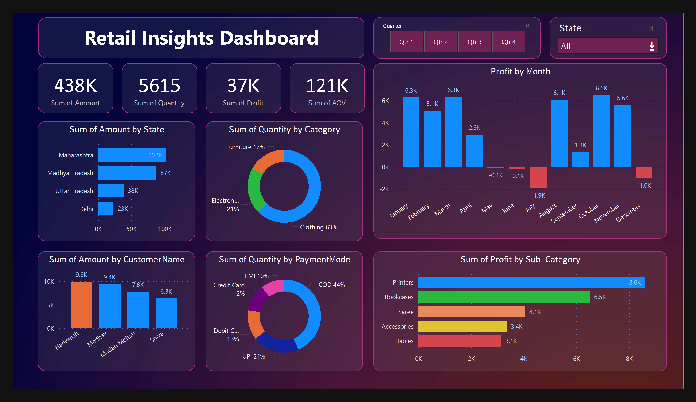

# ✨ Interactive Retail Sales Dashboard | Power BI 📊

An interactive and dynamic **Retail Sales Dashboard** built using **Power BI**. This project visualizes key retail metrics across states, time periods, categories, and payment types — enabling data-driven insights and better decision-making.

---

## 🔍 Key Insights & Features

### 📍 Dynamic Filtering
- Region-wise filtering to explore state-specific sales trends.
- Quarter toggling for seasonal comparison and performance review.

### 📦 Category & Payment Analysis
- Sales segmented by product categories: **Furniture, Electronics, Clothing**
- Visual breakdown of payment methods (COD, UPI, Credit Card, etc.)

### 💰 Profit Trends
- Monthly profit visualization to track growth and losses.
- Sub-category analysis reveals best-sellers and high-margin items.

---

## 🧠 Objectives

This project demonstrates:
- Effective data modeling in Power BI
- Use of slicers, filters, cards, and graphs for interactive dashboards
- Business intelligence and storytelling through visualization
- Turning raw transactional data into meaningful insights

---

## 🛠️ Tools Used

- **Power BI Desktop**
- DAX & Power Query (Data modeling & calculations)
- Custom visuals, slicers, and filters

---

## 🖼️ Screenshots

> *(Add your dashboard screenshots in a `/resources` folder and reference them here)*

---

